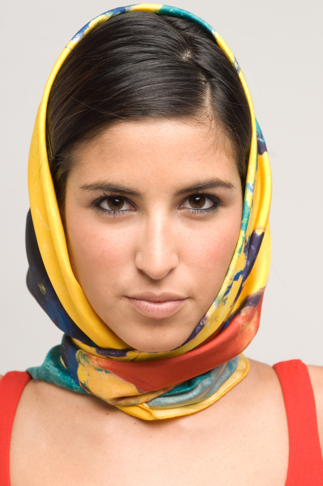

# XDoG (eXtended Difference of Gaussians)

This project is a Java application that implements the full **eXtended Difference of Gaussians (XDoG)** pipeline to produce stylized renderings of images. It converts input images into OKLab color space, computes structure tensors, applies directional blurs along edges, and then performs two LIC passes (thresholded and anti‑aliased). Results can be viewed in a simple Swing window and saved automatically.

This project can be a bit slow to render large images, since it runs entirely on the CPU and does not utilize parallel computing. While running the jar on the CMD it will display the time and memory each step takes.

**Based on the work of**: Holger Winnemöoller, Jan Eric Kyprianidis, Sven C. Olsen

<div align="center">
  <table>
    <tr>
      <td>
        
      </td>
      <td>
        
      </td>
    </tr>
    <tr>
      <td>
        
      </td>
      <td>
        
      </td>
    </tr>
    <tr>
      <table>
      <td>
        
      </td>
      <td>
        
      </td>
      <td>
        
      </td>
      <td>
        
      </td>
      </table>
    </tr>
  </table>
</div>

---

## Table of Contents

1. [Features](#features)  
2. [Usage](#usage)  
3. [How It Works](#how-it-works)  
4. [Additional Examples](#additional-examples)  

---

## Features

- **Full XDoG**  
  - Converts images to OKLab color space (with optional dynamic range)  
  - Computes and smooths the structure tensor for edge orientation  
  - Applies directional blur orthogonal to edges at two scales  
  - Two LIC passes: one with threshold or quantization, one for anti‑aliasing  
- **Post‑Processing Modes**  
  - **None**: raw output  
  - **Threshold**: hard‑clip plus smooth tanh transition  
  - **Quantization**: discrete tone levels  
- **Batch Processing & Saving**  
  - Flags to skip display and auto‑save  

---

## Usage

1. **Run** the `XDoG.jar` executable  
2. **Choose** the post‑processing mode: **Threshold** or **Quantization**  
3. **Set** the parameters:  
   - `sigmaC`  
   - `sigmaE`  
   - `sigmaM`  
   - `tau`  
   - `phi`  
   - `sigmaA`  
   - `levels`  
   - `useRange`  
4. **Drag & drop** one or more images into the window  
5. **Preview** the result in real time before saving  
6. **Save** naming convention:  
   - Without threshold:  
     ```
     originalName_XDoG[type].png
     ```  
   - With threshold (including range flag):  
     ```
     originalName_XDoG[type,boolean].png
     ```

---

## How It Works

1. **Color Conversion & Range**  
   - Convert ARGB pixels to normalized OKLab floats  
   - Optionally compute epsilon based on lightness distribution  

2. **Structure Tensor & Blur**  
   - Compute per‑channel Sobel gradients, assemble tensor (E, F, G)  
   - Smooth with a Gaussian blur  

3. **Directional Blur**  
   - Extract second eigenvector of the tensor at each pixel  
   - Blur along the orthogonal direction at two scales and subtract  

4. **Line Integral Convolution**  
   - Pass 1: Convolve along the vector field, apply threshold or quantization  
   - Pass 2: Convolve again for anti‑aliasing  

5. **Reassembly & Saving**  
   - Convert the final float array back to an ARGB image  
   - Display and/or save with a descriptive filename

---

## Additional Examples

By blending the XDoG output with the original image we can bring back colors.  

<div align="center">
  <table>
    <tr>
      <td>
        
      </td>
      <td>
        
      </td>
    </tr>
    <tr>
      <td>
        
      </td>
      <td>
        
      </td>
    </tr>
    <tr>
      <table>
        <td>
          
        </td>
        <td>
          
        </td>
        <td>
          
        </td>
        <td>
          
        </td>
      </table>
    </tr>
  </table>
</div>

---
